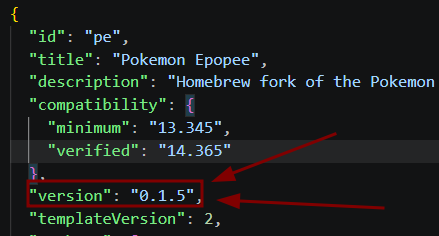
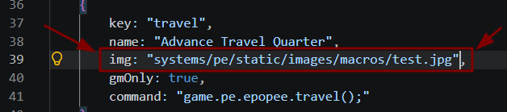
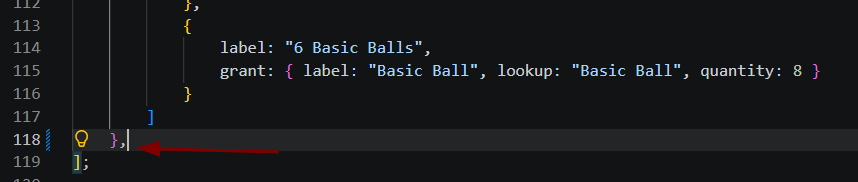

# ToolBox pour modif PE

### Push nouvelle version
Pour push une màj effective, qui sera pris en compte dans les prochaines sessions de jeu, incrémenter le numero de version dans le fichier system.json

#

### Ajouter des nouvelles images/icones aux macros
Pour faire ça il suffit de trouver l'endroit dans lequel les images sont renseignées, ajouter l'image dans un dossier existant ou en créer un autre et mettre sont path relatif soit celui depuis la racine du projet git.

Exemple avec la macro "Advance Travel Quarter" dans src\module\setup\macros.js

#

### Balancing combat

Path: src\module\combat-math

#

### Ajouter de nouvelles origines

Path: src\module\origins\data.js

Une origine existe déjà il suffit de la copier coller en séparant bien les 2 d'une virgule

